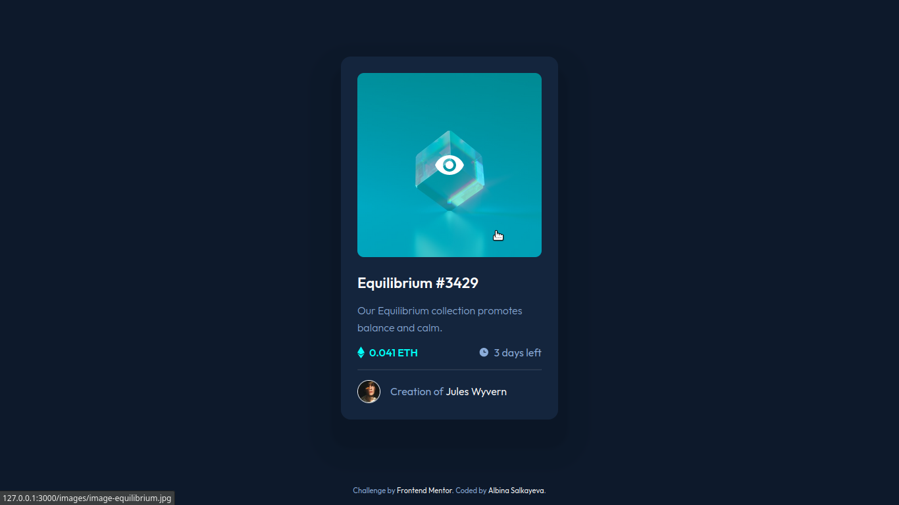

# Frontend Mentor - NFT preview card component solution

This is a solution to the [NFT preview card component challenge on Frontend Mentor](https://www.frontendmentor.io/challenges/nft-preview-card-component-SbdUL_w0U). Frontend Mentor challenges help you improve your coding skills by building realistic projects. 

## Table of contents

- [Overview](#overview)
  - [The challenge](#the-challenge)
  - [Screenshots](#screenshots)
  - [Links](#links)
- [My process](#my-process)
  - [Built with](#built-with)
  - [What I learned](#what-i-learned)
  - [Useful resources](#useful-resources)
- [Author](#author)

## Overview

### The challenge

Users should be able to:

- View the optimal layout depending on their device's screen size
- See hover states for interactive elements

### Screenshots

### Links

- Solution URL: [https://github.com/albina0104/nft-preview-card-component](https://github.com/albina0104/nft-preview-card-component)
- Live Site URL: [https://albina0104.github.io/nft-preview-card-component/](https://albina0104.github.io/nft-preview-card-component/)

## My process

### Built with

- Semantic HTML5 markup
- CSS custom properties
- Flexbox

### What I learned

I learned how to add a nice hover effect on an image.

### Useful resources

- [CSS Styling Images](https://www.w3schools.com/css/css3_images.asp) - A section "Image Hover Overlay" of this W3Schools tutorial has good examples of how to add hover effects to images. It helped me to learn how to do it. I really liked these examples and will use them going forward.
- [Code example on W3Schools](https://www.w3schools.com/css/tryit.asp?filename=trycss_css_image_overlay_opacity) - This is one of the examples that helped me with my solution.

## Author

- Frontend Mentor - [@albina0104](https://www.frontendmentor.io/profile/albina0104)
- GitHub - [albina0104](https://github.com/albina0104)
